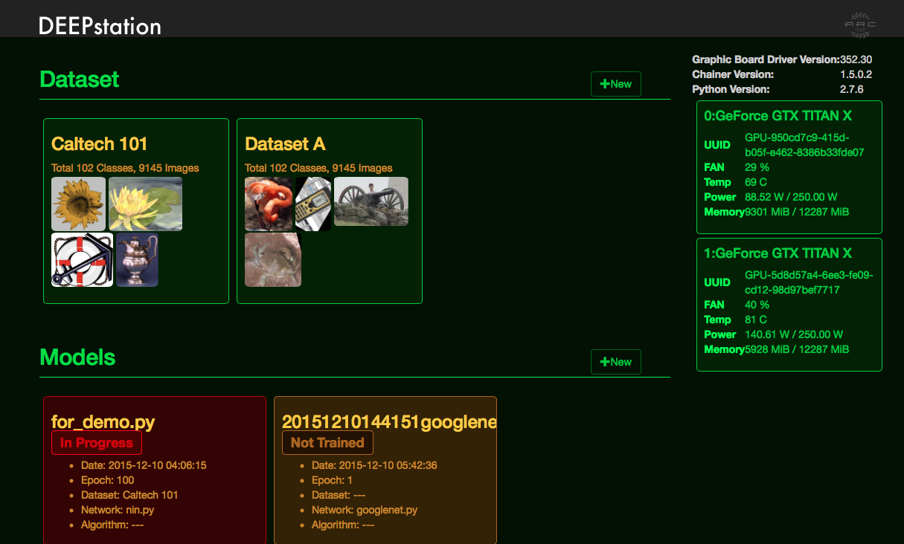
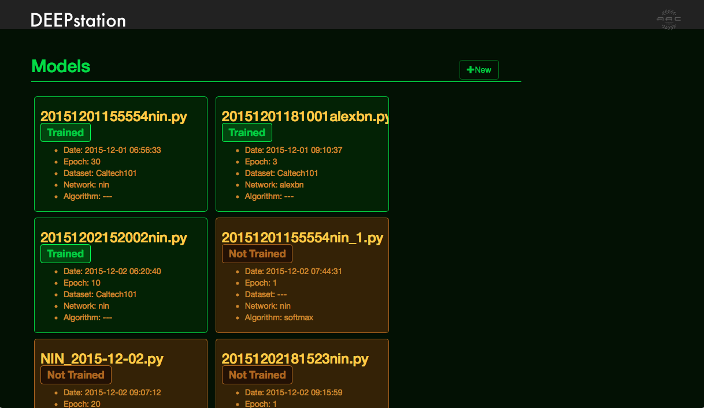
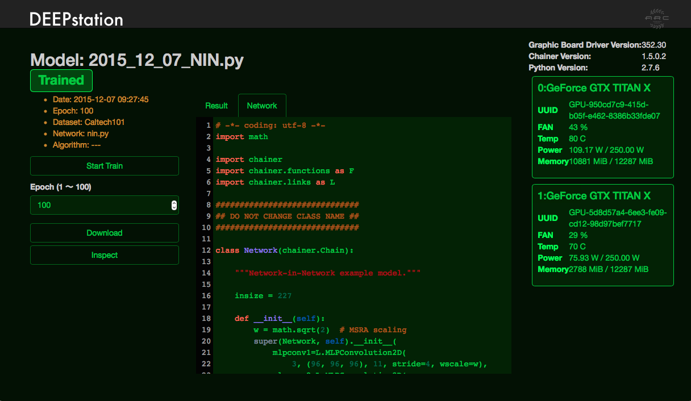
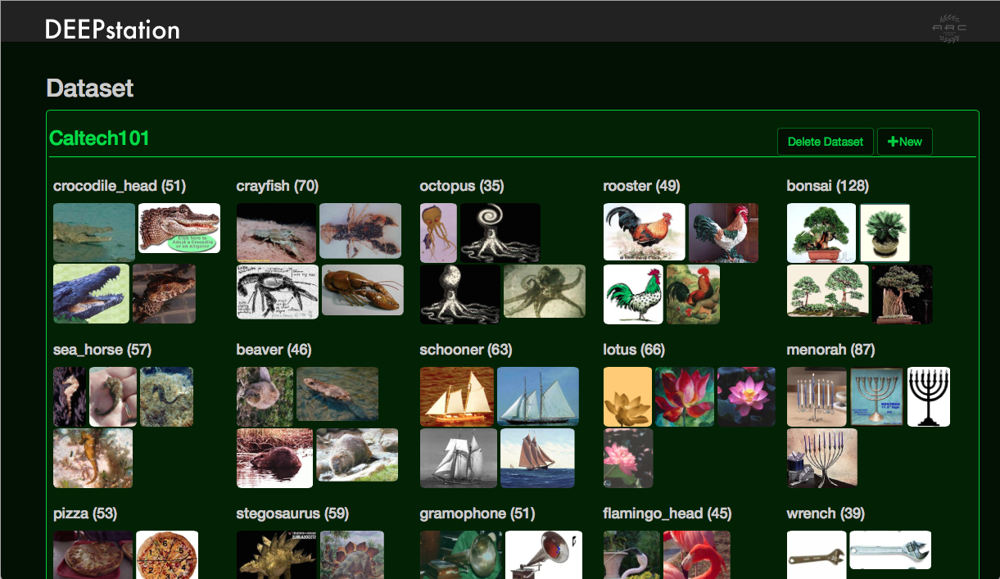

DEEPstation
============

DEEPstation version 0.1.0

Browser based GUI deep learning tool.

Screenshots
-------------

### Top page
#### Datasets

#### Modes

### Model detail page 
#### Train result

#### View and Edit model

### Dataset page

Requirement
------------

DEEPstation is tested on Ubuntu 14.04. We recommend them to use DEEPstation, though it may run on other systems as well.

### System
* NVIDIA CUDA Technology GPU and drivers 
* Python 2.7
  * python-opencv
* SQLite3

### Python Libraries
* Chainer 1.5 http://chainer.org
* bottle
* bottle_sqlite
* cv2
* PyYAML

Setup
------

* Edit `settings.yaml` to set paths for saving files.
* Setup database. Try command below on root directory of DEEPstation.  
`sqlite3 deepstation.db < ./scheme/deepstation.sql`
* Startup server. `python main.py`
* Access `http://localhost:8080` on your browser.   
If you have changed hostname and port on `settings.yaml`, use that one.

Usage
------

### Creating Dataset
* Upload dataset from '+new' button on Dataset section on top page. 
* Dataset is a zip file which contains classifeid images by directory like [Caltech 101](http://www.vision.caltech.edu/Image_Datasets/Caltech101/) dataset.

### Creating Model
* Make model from '+new' button on Models section on top page.
* Select network template from list.
* Edit it, if you want.
* Press 'Create' button. Then model is created and move to model detail page.

### Start Train
* Select created Model from top page.
* Press 'start train' button.
  * Fill in forms and start train.

### Inspection

* Move to 'Model' page.
* Chose 'Epoch' which you want to use for inspection.
* Press 'inspect' button.
* Select image(.jpg) for inspection.
* Press 'Submit'. Then you will see the result of inspection.

Tips
-----

### Cleaning up temporary files

Training makes a lot of temporary images on your `prepared_data` directory.  
If you want to remove these images, access `http://localhost:8080/cleanup` on your browser.  
It removes temporary images **IMMEDIATELY**.

License
--------

* MIT License

DEEPstation
============

ブラウザベースのGUI深層学習ツール

Requirement
------------

DEEPstationはUbuntu14.04でテストしています。 Ubuntu上で動かすことをおすすめしますが、他のプラットフォームでも動作します。

### System
* NVIDIA CUDA Technology GPU and drivers 
* Python 2.7
  * python-opencv
* SQLite3

### Python Libraries
* Chainer 1.5 http://chainer.org
* bottle
* bottle_sqlite
* cv2
* PyYAML

Setup
------

* 各種ファイルの保存場所を`settings.yaml`に定義します。
* データベースのセットアップを行います。DEEPstationをダウンロードしたディレクトリで下記のコマンドを実行してください。  
`sqlite3 deepstation.db < ./scheme/deepstation.sql`
* サーバを起動します。DEEPstationをダウンロードしたディレクトリで `python main.py`を実行します
* ブラウザで `http://localhost:8080` にアクセスします。  
`settings.yaml`でhostnameとportを変更している場合はそちらを利用してください。

使い方
------

### Datasetの作成
* トップページで、Datasetのセクションにある'+new'ボタンを押します。
* Datasetはzipで圧縮された、ディレクトリ毎にカテゴリ分けされた画像セットです。[Caltech 101](http://www.vision.caltech.edu/Image_Datasets/Caltech101/)のような構造になっている必要があります。

### Modelの作成
* トップページで、Modelsのセクションにある'+new'ボタンを押します。
* Networkのテンプレートが用意されているので、そちらを選択します。
  * 必要であればその場で編集してください。編集しないでも動きます。
* 'Create'ボタンをおすとModelが作成され、Modelの詳細画面に遷移します。

### 学習の開始
* トップページで、作成済みモデルを選択します。
* 'start train'ボタンを押します。
  * フォームを埋めて学習を開始します。

### 画像の予測(inspection)

* トップページから学習済みModel('Trained'となっているModel)に移動します。
* 予測に利用する学習済みモデルのEpochを指定します。
* 'inspect'ボタンを押します。
* 予測させたい画像(jpg)を選択します。
* 'Submit'ボタンを押します。すると、予測結果が表示されます。

Tips
-----

### 一時ファイルの削除

学習ではたくさんの一時ファイルを`prepared_data`ディレクトリに作成します。  
もし、これらの画像を削除したい場合は `http://localhost:8080/cleanup` にブラウザでアクセスします。 
すると、作成された一時ファイルが **ただちに** 削除されます。

License
--------

* MIT License
